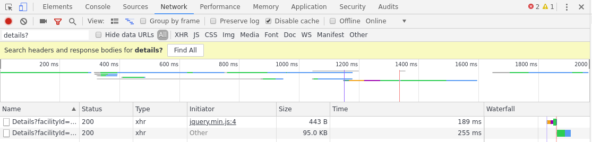
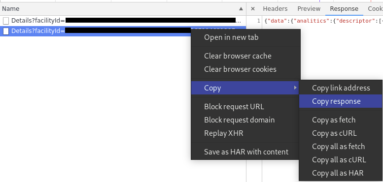

# mywellness-extractor

A Clojure library to convert convert MyWellness® json training data to Training Center XML.

## Usage

### Getting the raw data from MyWellness
1. Open up Google Chrome.
2. Log in to mywellness.com and navigate to the workout you want to convert.
3. Open the developer tools and navigate to the network tab.
4. Refresh the page
5. filter the requests by `Details?` 

6. Right click the last one and `Copy -> Copy respose`

7. The raw data is now on the clipboard.
8. Save it to a file.

### Converting the data 

## License

Copyright © 2019 Marcus Alsterman